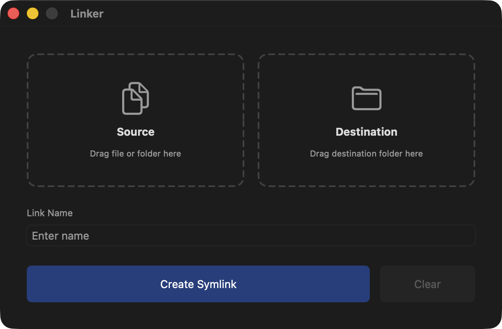

# Linker

Linker is a straightforward macOS utility to create symlinks without touching the command line.

Just drag in a source file/folder, a destination folder, name it if you want (it uses the source item's name by default), and click the button. Your new symlink will be shown in Finder.

</img>

You can select and clear either drop zone by hitting Delete, or use the Clear button to start over. The app won't overwrite anything but symlinks to avoid accidental data loss.

## Installation

You can download from the [Releases](https://github.com/dannystewart/Linker/releases) page, or install via **Homebrew** (recommended):

```bash
brew install dannystewart/apps/linker
```
